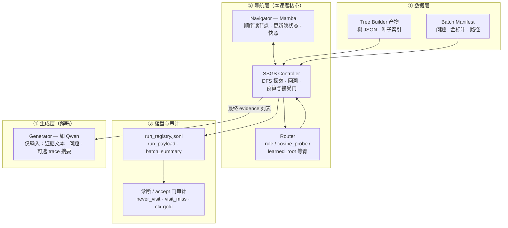
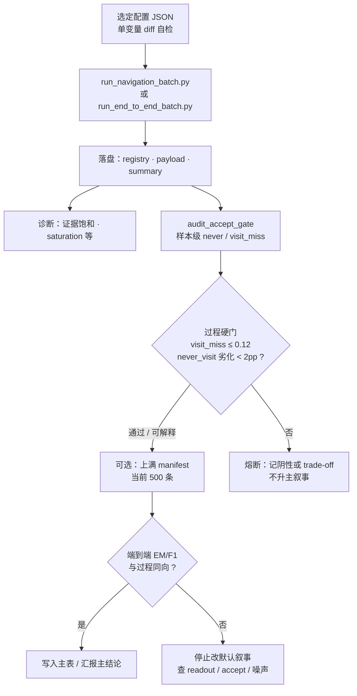

# 树状 RAG 导航系统 — 阶段进展汇报（呈阅稿）

**文档性质**：可直接打印或导出 PDF 供导师阅读；亦可作为组会讲稿提纲。  
**建议汇报时长**：口头 **12～18 分钟**（图表与 §4 为主干，其余可附录化）。

**说明**：下图表需在支持 **Mermaid** 的查看器中渲染（如 GitHub、VS Code 预览、Typora 等）；若导师环境不支持，可将图中代码块复制至 [https://mermaid.live](https://mermaid.live) 导出 PNG 插入 Word。

---

## 摘要

本阶段工作围绕 **树状结构上的多步导航与回溯**：以 **Mamba** 作为导航侧状态更新器，以 **Router + SSGS Controller** 完成子节点排序与 DFS/回溯控制，与 **Transformer 生成器** 解耦；在真实子集与统一 manifest 上建立 **可复现批跑、落盘 trace、接受门审计** 的闭环。导航侧已将 **`never_visit`（从未触达任一金叶）** 从 **`probe2` 纯 `rule` 约 0.58** 量级压至 **实体偏置默认工作点 `122155Z` 约 0.38**（满 500），并保持 **`visit_miss`（visit 金叶但未过 accept）≤0.12** 的过程硬门。下一步优先 **满 500 复核 `max_evidence=14`** 与 **`122155Z` 同旋钮端到端**，验证过程指标与 **EM/F1** 是否同向传导。

---

## 1. 课题定位与边界（导师第一眼）

| 项目 | 内容 |
|:---|:---|
| **研究对象** | 树状知识上的 **导航状态管理与搜索控制**（非「用 Mamba 取代 Transformer 做答案生成」） |
| **阶段目标** | **可运行、可审计、可复现** 的检索—证据闭环；**再**讨论导航改动向最终答案质量的稳定传导 |
| **不主张（现阶段）** | Mamba 全面优于 Transformer；无充分归因即宣称榜单大幅领先；将 **Oracle 作弊上界** 与真实导航臂混谈 |
| **叙事纪律** | **过程指标与终点指标并列**；过程升、终点降时 **不写入主结论**（工程专档 MI-004 / MI-005） |

---

## 2. 整体框架结构图

下图概括 **数据 → 导航控制 → 证据输出 → 生成 / 评测** 的模块边界（与 `SSGS_Research_Framework_CN.md` 一致）。

**读图要点（可对着图讲 1 分钟）**

- **Mamba 不负责「选哪条边」**：决策在 **Router + Controller**；Navigator 提供 **随路径更新的表示与快照恢复能力**。  
- **Generator 不读 Mamba 隐状态**：只读 **文本证据**，因此可以把「导航好坏」与「读证据写答案」拆开归因。  
- **Registry / Audit** 把「系统到底访问了哪里、为何被拒、金叶在不在上下文」变成 **可表格化的实验事实**。

---

## 3. 工作流程（从实验到结论）

**口头可压缩为三句**

1. **先协议、再跑批**：同一 manifest、同一训练 checkpoint（learned 臂），避免「假单变量」。  
2. **先过程、再终点**：`never_visit` / `visit_miss` / ctx-gold 与 **EM/F1** 一起看。  
3. **不过门不硬推**：例如 **`visit_miss` > 0.12** 的臂，只可作 **trade-off** 备忘，不替换当前默认 **`122155Z`**。

---

## 4. 创新点与贡献表述（建议口径）

以下表述与 **`SSGS_Research_Framework_CN.md`** 中 RQ1–RQ3 对齐，**适合写在开题/阶段汇报的「创新点」栏**，避免过度承诺。

| 类型 | 内容 |
|:---|:---|
| **体系结构** | **Navigator–Generator 解耦** + **冻结 trace 字段**：导航过程可记录、可审计、可与生成结果对照归因。 |
| **机制切入点** | 以 **Mamba 固定大小隐状态 + 节点级快照恢复** 支撑树导航中的 **多步试探与回溯**；讨论焦点在 **状态管理是否利于深层探索下的工程代价**，而非「单步算子碾压 Transformer」。 |
| **控制与评测** | **SSGS Controller** 将 DFS、预算、接受门与 Router 策略 **显式化**，并与 **accept 门审计** 联动，使「金叶从未被 visit」与「visit 后未进 accept」**可分桶统计**——这是当前阶段改进导航的主要抓手。 |
| **实验方法** | **单变量 + 满 manifest 主表 + `n=200` 熔断对齐** 的分工（见 `Navigation_Experiment_Record_CN.md` §6.0），减少「扫参叙事」与主结论混写。 |

**建议一句收束**：本阶段 **工程与创新并重** 的交付是 **「可证伪的导航—证据协议」**；数值上已展示 **在严格过程门下显著压低 `never_visit`**，**传导到最终 EM 的提升仍在端到端验证队列中**。

---

## 5. 阶段主要结果（数据表）

### 5.1 导航主锚（满 manifest，500 条）

| 对比项 | 代表 `batch_id`（后缀） | `never_visit` | `visit_miss`（约） | 汇报一句话 |
|:---|:---|---:|---:|:---|
| **`probe2` 纯 `rule`（实体偏置前）** | `…041200Z` | **~0.58** | ~0.12 | 旧主矛盾：**过半样本从未 visit 金叶** |
| **实体偏置默认工作点** | `…122155Z` | **~0.38** | **~0.11** | **在过程门内显著压低 `never_visit`**，当前 **`rule` 侧默认候选** |

*指标来源：`accept_gate_audit_*.json` 顶层字段；与早期 **`pilot200` / `never_visit_gold`** 等**不同字段名/协议**勿混读。*

### 5.2「④ 逼近 Oracle」单变量烟测（`n=200`，与 `122155Z` 同栈，2026-04-19）

**设定**：真实导航（**非** `oracle_item_leaves`、**非**注入 `leaf_indices_required`）；**硬门**：**`visit_miss` ≤ 0.12**。

| 单变量臂 | `batch_id` | `never_visit` | `visit_miss` | 叶级 disposition（摘要） | 结论 |
|:---|:---|---:|---:|:---|:---|
| **`max_evidence` 12→14** | `nav_p0_visit_rule_entity_boost_a030_abl_maxev_14_20260419_042514Z` | 0.39 | 0.10 | cap 25 / minrel 4 | 与烟测锚同档，**过门** → **建议满 500 复核** |
| **`cosine_probe`** | `nav_p0_visit_rule_entity_boost_a030_cosine_probe_20260419_044414Z` | **0.20** | **0.19** | cap 41 / minrel 9 | **`never_visit` 大赢** 但 **visit 不过门** → **trade-off**，不替换默认 |
| **`learned_root` α=0.5** | `nav_p0_visit_rule_entity_boost_a030_learned_root_blend05_20260419_044815Z` | 0.41 | 0.11 | cap 25 / minrel 5 | 相对锚 **无优势** → **满 500 优先度低于 max_ev** |

**辅助观察**：`cosine_probe` 臂 **`frac_samples_with_any_gold_in_context` 达 0.795**，与 **`never_visit` 大降** 同向，但 **accept 变差**，说明 **「探索变强」不等于「证据链可稳定交付给生成器」**。

---

## 6. 瓶颈与下一步（可验收）

| 瓶颈 | 解释 |
|:---|:---|
| Oracle gap | 上界仍远高于真实导航 → 瓶颈在 **导航 + 证据消费**，非单靠换大生成模型 |
| 指标分列 | **`never_visit`**（从未触达）与 **`visit_miss` / gold-in-context**（触达但未接受）需分开讲 |
| 下一步 P0 | **`max_evidence=14` 导航满 500** + 与 **`122155Z`** 对照；劣化 ≥2pp 则熔断 |
| 下一步 P1 | **`122155Z` 同旋钮 e2e**：过程与 **EM/F1** 是否同向 |

---

## 7. 口头汇报顺序建议（约 15 分钟）

1. **摘要 + §1**（2 min）  
2. **§2 结构图 + §3 流程图**（4 min）  
3. **§4 创新点**（2 min，强调可审计与解耦）  
4. **§5 数据表**（4 min）  
5. **§6 + Q&A**（3 min）

---

## 8. 附录：文档与仓库索引

| 文档 | 用途 |
|:---|:---|
| `docs/research/Navigation_Experiment_Record_CN.md` | **实验事实与 `batch_id`**（§6.0、§6.6、§6.7） |
| `docs/research/SSGS_Research_Framework_CN.md` | **研究问题 RQ、主张边界** |
| `docs/Major_Issues_And_Resolutions_CN.md` | **判停与工程归因（MI-004 等）** |

*若本文与 `Navigation_Experiment_Record_CN.md` 冲突，**以实验记录专档为准**。*
