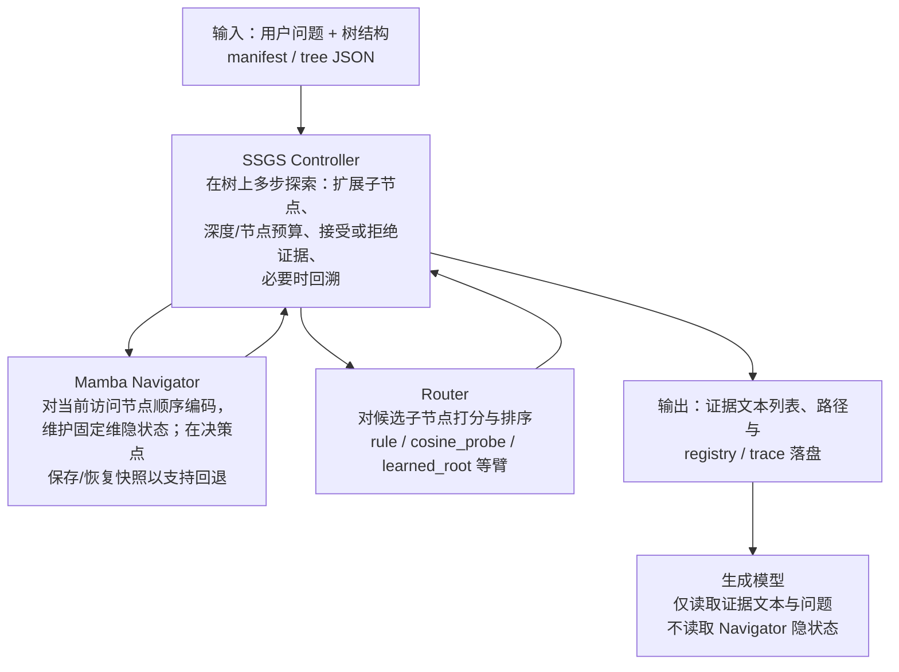

# 树状 RAG 导航系统 — 第一次阶段汇报

---

## 摘要（建议口头先讲）

本课题要做的是：**在长文档构成的树状结构上，做多步检索式导航与可回溯探索**，把「证据如何被找到、是否该进上下文」与「最终答案生成」**拆开**：导航侧用 **Mamba 维护可快照恢复的隐状态**，用 **Router + SSGS Controller** 负责排序与搜索控制；生成侧固定为成熟 **Transformer**，只读**文本证据**。  
**第一次汇报侧重**：**问题是什么、系统长什么样、数据在系统里怎么走**；**不把「已有多少条实验数字」当作主线**——具体 batch 与表格见仓库 **`Navigation_Experiment_Record_CN.md`**，需要时单独展开。

---

## 1. 要解决什么问题（为什么值得做）

| 痛点 | 说明 |
|:---|:---|
| **平面 RAG 的局限** | 扁平 chunk 难以覆盖长文档主题与多跳依赖；树同时提供 **摘要层与叶子证据层**，更贴近「先定位主题再找句证据」的阅读方式。 |
| **多步决策会走错** | 一旦早期选错分支，错误上下文会持续干扰；需要 **试探—评估—回溯** 的闭环，而不是单向前进。 |
| **状态与代价** | 传统 Transformer 在长链路上依赖 **随长度增长的 KV**；走错再退的 **重算与显存** 成本高。 |
| **本课题的切入点** | 用 **Mamba 类固定维隐状态 + 节点级快照**，为树上的多步导航提供 **可恢复的状态载体**；**不**主张用 Mamba 取代生成模型，而是 **把「探路」与「写答案」分工**。 |

**一句话**：在长文档 **树** 上，做一个 **可回溯、可审计** 的导航框架，再讨论它能否 **稳定改善** 最终读证据答题的质量。

---

## 2. 核心研究问题（RQ，与框架文档一致）

| 编号 | 问题 |
|:---|:---|
| **RQ1（机制）** | Mamba 的状态快照与恢复，能否 **稳定支撑** 树状检索中的回溯控制？ |
| **RQ2（系统）** | Navigator 与 Generator **解耦** 后，能否形成 **完整、可复现、可审计** 的闭环？ |
| **RQ3（价值）** | 在 **深层探索或资源受限** 场景下，这种导航方式是否在 **系统层面** 有可讨论的优势（未必等价于「榜单全面碾压」）？ |

---

## 3. 本工作「具体在做什么」（系统对象与阶段交付）

### 3.1 系统对象（四块）

| 模块 | 做什么 |
|:---|:---|
| **Tree Builder 侧输入** | 文档 → **树**（节点文本、父子关系、叶子索引等）+ **样本 manifest**（问题、金标叶索引、路径等）。 |
| **Navigator（Mamba）** | 沿访问路径读节点、更新 **固定维隐状态**、在决策点 **保存/恢复快照**，为「回退再试」提供状态基础。 |
| **Router + SSGS Controller** | **Router**：对候选子节点打分排序（多种策略臂）。**Controller**：DFS 式探索、深度/节点/证据预算、接受门、**回溯** 与终止条件。 |
| **Generator** | 只接收 **证据文本列表**（及问题、可选 trace 摘要）；**不**读取 Navigator 内部张量。 |

### 3.2 第一阶段要交出的「东西」（能力清单，而非榜单）

在「大规模追榜」之前，阶段目标更贴近：

- 从问题与树到证据列表的 **端到端可跑通**；  
- **冻结字段的 trace / registry**，能回答「访问了哪些节点、是否 rollback、证据是什么」；  
- **导航过程指标** 与 **生成 EM/F1** 能 **分列记录、对照归因**（避免把生成噪声写成导航收益）。

---

## 4. 系统框架与 Mamba 的作用

### 4.1 Mamba 在框架中做什么（不做什么）

|  |  |
|:---|:---|
| **做什么** | **Navigator**：在 Controller 驱动下顺序读 **当前节点文本**，更新 **固定维隐状态**；在快照点 **保存**，回溯时 **恢复**，再继续或改向。产出是 **供 Router / 控制逻辑使用的表示**，不是最终答案。 |
| **不做什么** | **不**直接生成答案；**不**替代 Router 决策子边；**不**把隐状态喂给生成模型。 |

一句话：**Mamba 负责「沿树走路时的状态与可逆恢复」；Router + Controller 负责「往哪走、何时退」。**

### 4.2 模块结构图（自上而下）

**三条边界**：决策在 **Controller + Router**；Mamba **只服务导航链路**；生成模型与导航 **内部状态隔离**。

---

## 5. 数据处理与推理流程（框架视角，纯文字）

以下描述 **单条样本** 从进入系统到交给生成模型的 **运行时路径**（与具体批脚本无关）。

1. **输入**  
   系统接收 **自然语言问题** 以及该样本对应的 **树结构**（由预处理与 manifest 提供）。

2. **由 Controller 主持的多步导航**  
   Controller 在树上做 **深度优先式** 探索：在 **最大深度、最大节点数、证据条数上限** 等约束下，反复 **扩展—评估—可能回溯**。需要排序时调用 **Router**；需要编码当前节点时调用 **Mamba Navigator**。

3. **Mamba Navigator 的一步**  
   对 **当前节点文本** 顺序编码，更新 **固定大小隐状态**；在快照点保存，路径被否定时 **恢复快照** 回到分支点。产出为 **状态表示**，不是最终句子。

4. **Router 的一步**  
   在候选子节点上结合问题、子节点文本、Navigator 特征等，按策略臂输出 **分数或排序**，交还 Controller。

5. **形成交给生成模型的输入**  
   导航结束后得到 **证据文本列表**（及可选路径摘要），经上下文构建与截断后，作为生成模型的 **主要文本上下文**。

6. **生成与评测**  
   生成模型基于 **问题 + 证据** 输出答案；评测端可统计 **EM/F1**，并与导航侧 **金叶是否被 visit、是否进入 accept/context** 等 **分列对照**。

---

## 6. 工作定位与创新（汇报用语）

| 维度 | 表述 |
|:---|:---|
| **结构** | **Navigator–Generator 解耦** + **可追溯 trace**：把「证据从哪来」说清楚，再谈「答案好不好」。 |
| **机制** | 用 **固定维状态 + 快照** 承载树上的 **多步试探与回溯**；讨论的是 **导航侧状态管理**，不是用同一 backbone 包打生成。 |
| **控制** | **SSGS Controller** 把探索、回溯、预算、接受逻辑 **显式化**，便于与审计指标对齐。 |

**边界（第一次汇报建议主动说）**：现阶段 **不** 把「Mamba 全面优于 Transformer」或「无归因的榜单跃升」写成主结论；**Oracle 上界** 仅作 gap 参照，**不与**真实导航臂混谈。

---

## 7. 当前进展放在什么位置讲

**口头建议**：第一次汇报用 **约 1～2 分钟** 交代即可——

- 已在 **真实子集 manifest** 上跑通 **导航批、诊断、接受门审计** 与 **可选端到端**；  
- 导航侧在 **严格过程门** 下，把「从未 visit 金叶」比例 **相对早期 `probe2` 纯 rule 主锚有明显压低**，并形成了 **默认工作点与单变量台账**（便于后续写论文时「可证伪」）。  

**不展开数字时**，可一句话：**「具体 batch_id、表与判停细则在 `Navigation_Experiment_Record_CN.md`。」**

若导师要求看表，再打开附录或实验记录专档。

---

## 附录 A：初步结果速查（可选展示）

*与正文分工：正文讲「做什么」；本附录仅备追问时使用。*

| 对比项 | `never_visit`（约） | `visit_miss`（约） | 备注 |
|:---|---:|---:|:---|
| `probe2` 纯 `rule` 满 500（`041200Z`） | ~0.58 | ~0.12 | 旧主矛盾锚 |
| 实体偏置默认 `122155Z` 满 500 | ~0.38 | ~0.11 | 当前 `rule` 侧默认候选 |

「④」单变量 **`n=200`** 烟测（`max_ev14` / `cosine_probe` / `learned_root`）的 `batch_id` 与判读见 **`Navigation_Experiment_Record_CN.md` §6.7**。

---

## 附录 B：仓库文档索引

| 文档 | 用途 |
|:---|:---|
| `docs/research/Navigation_Experiment_Record_CN.md` | 实验事实、`batch_id`、表格 |
| `docs/research/SSGS_Research_Framework_CN.md` | RQ、主张边界、框架定义 |
| `docs/Major_Issues_And_Resolutions_CN.md` | 判停与工程归因 |

*若本文与 `Navigation_Experiment_Record_CN.md` 冲突，以实验记录专档为准。*

---

## 附录 C：第一次汇报时间分配建议（约 15 分钟）

| 块 | 内容 | 约 |
|:---|:---|---:|
| 1 | 摘要 + §1 要解决什么问题 | 3 min |
| 2 | §2 RQ + §3 四块与阶段交付 | 3 min |
| 3 | §4 Mamba + 结构图 | 3 min |
| 4 | §5 数据处理与推理流程（纯文字） | 3 min |
| 5 | §6 定位与创新 + §7 进展一句带过 | 2 min |
| 6 | 问答；追问数字时再翻附录 A | 1–2 min |
