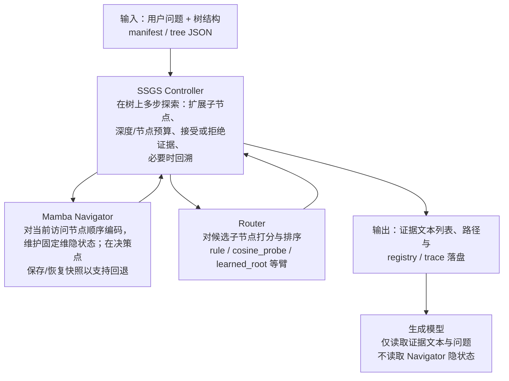

# 树状 RAG 导航系统 — 阶段进展汇报

---

## 摘要

本阶段围绕 **树状结构上的多步导航与回溯**：以 **Mamba** 作为导航侧 **状态编码器**，以 **Router + SSGS Controller** 完成子节点排序与探索/回溯/预算控制，与 **Transformer 生成器** 解耦；在真实子集与统一 manifest 上建立可复现批跑、落盘 trace 与接受门审计。导航侧已将 **`never_visit`（从未触达任一金叶）** 从 **`probe2` 纯 `rule` 约 0.58** 量级压至 **实体偏置默认工作点 `122155Z` 约 0.38**（满 500），并保持 **`visit_miss`（visit 金叶但未过 accept）≤0.12** 的过程硬门。后续将 **满 500 复核 `max_evidence=14`**，并在 **`122155Z` 同旋钮**上做端到端，检验过程指标与 **EM/F1** 是否同向。

---

## 1. 课题定位与边界

| 项目 | 内容 |
|:---|:---|
| **研究对象** | 树状知识上的 **导航状态管理与搜索控制**（非「用 Mamba 取代 Transformer 做答案生成」） |
| **阶段目标** | **可运行、可审计、可复现** 的检索—证据闭环；再讨论导航改动向最终答案质量的稳定传导 |
| **现阶段不主张** | Mamba 全面优于 Transformer；无充分归因即宣称榜单大幅领先；将 **Oracle 作弊上界** 与真实导航臂混谈 |
| **叙事纪律** | **过程指标与终点指标并列**；过程升、终点降时不写入主结论（工程专档 MI-004 / MI-005） |

---

## 2. 系统框架与 Mamba 的作用

### 2.1 Mamba 在框架中做什么（不做什么）

|  |  |
|:---|:---|
| **做什么** | **Navigator**：在 Controller 驱动下，按访问顺序读取 **当前节点文本**，将信息压入 **固定维度的隐状态**；在需要回退时，利用 **节点级状态快照** 恢复到历史决策点，再继续或改向探索。即：Mamba 提供 **随路径更新的向量表示** 与 **可恢复的状态载体**，供 Router 与 Controller 使用。 |
| **不做什么** | **不**直接生成最终答案；**不**替代 Router 做「选哪条子边」的决策；**不**把隐状态喂给生成模型（生成端只读 **文本证据**）。 |

一句话：**Mamba 是「沿树走路时的状态记录与可逆恢复」的引擎；Router + Controller 决定「往哪走、何时退」。**

### 2.2 模块结构图（自上而下）

**与上图对应的三条边界**：① **决策在 Controller + Router**；② **Mamba 只服务导航链路的表示与快照**；③ **生成模型与导航内部状态隔离**，便于把「证据是否到位」与「读证据写答案」分开讨论。

---

## 3. 数据处理与推理流程（框架视角，纯文字）

以下描述 **单条样本** 从进入系统到交给生成模型的 **运行时路径**（与具体批脚本无关）。

1. **输入**  
   系统接收 **自然语言问题** 以及该样本对应的 **树结构**（节点文本、父子关系、叶子索引等；由预处理与 manifest 提供）。

2. **由 Controller 主持的多步导航**  
   Controller 在树上执行 **深度优先式** 的探索：从根（或当前焦点）出发，在 **最大深度、最大节点数、证据条数上限** 等约束下，反复 **扩展—评估—可能回溯**。  
   每一步需要「当前路径下对候选子节点的排序依据」时，Controller 调用 **Router**；需要「把当前访问节点编码进可携带的状态」时，Controller 调用 **Mamba Navigator**。

3. **Mamba Navigator 的一步**  
   对 **当前正在访问的节点文本** 做顺序编码，更新 **固定大小的隐状态**；在 Controller 指定的 **快照点** 保存状态，若后续判定路径不佳，则 **恢复快照** 并回到分支点继续搜索。  
   其直接产出是 **供 Router / 价值判断使用的状态表示**，而不是最终句子答案。

4. **Router 的一步**  
   在 Controller 给出的候选子节点上，结合 **问题、子节点文本、Navigator 状态特征** 等，按所选策略臂（如 rule、cosine、learned 根混合等）输出 **分数或排序**，交还 Controller 决定访问次序与剪枝。

5. **形成交给生成模型的输入**  
   当 Controller 结束导航阶段，得到 **定长的证据文本列表**（以及可选的 **路径/trace 摘要**）。该列表经过上下文构建与截断策略后，作为 **生成模型的唯一主要上下文**（与导航内部张量无关）。

6. **生成**  
   生成模型在固定 prompt 与解码设置下，基于 **问题 + 证据文本** 输出答案；评测端可独立统计 **EM/F1** 等，并与导航侧 **是否 visit 金叶、是否进入 accept/context** 等过程指标对照归因。

---

## 4. 创新点与贡献表述（建议口径）

| 类型 | 内容 |
|:---|:---|
| **体系结构** | **Navigator–Generator 解耦** 与 **可追溯 trace**：导航过程可记录、可审计、可与生成结果对照归因。 |
| **机制切入点** | 以 **Mamba 固定维隐状态 + 快照恢复** 承载树上的 **多步试探与回溯**；讨论焦点在 **深层探索下的状态管理与工程代价**，而非用同一模型包打「导航+生成」。 |
| **控制与评测** | **SSGS Controller** 将探索、回溯、预算与接受逻辑显式化，并与 **accept 门审计** 等结合，使「从未 visit 金叶」与「visit 后未进 accept」可分桶分析。 |

**收束句**：当前阶段在数值上已展示 **在过程硬门下显著压低 `never_visit`**；**导航改进向 EM 的稳定传导** 需在 **固定生成器与同一 manifest** 的端到端中继续验证。

---

## 5. 阶段主要结果（数据表）

### 5.1 导航主锚（满 manifest，500 条）

| 对比项 | 代表 `batch_id`（后缀） | `never_visit` | `visit_miss`（约） | 一句话 |
|:---|:---|---:|---:|:---|
| **`probe2` 纯 `rule`（实体偏置前）** | `…041200Z` | **~0.58** | ~0.12 | 过半样本从未 visit 金叶 |
| **实体偏置默认工作点** | `…122155Z` | **~0.38** | **~0.11** | 过程门内显著压低 `never_visit`，当前 `rule` 侧默认候选 |

*指标来源：`accept_gate_audit_*.json`；与早期 **`pilot200` / `never_visit_gold`** 等不同字段勿混读。*

### 5.2「④ 逼近 Oracle」单变量烟测（`n=200`，与 `122155Z` 同栈，2026-04-19）

**设定**：真实导航（非 `oracle_item_leaves`、非注入 `leaf_indices_required`）；**硬门**：**`visit_miss` ≤ 0.12**。

| 单变量臂 | `batch_id` | `never_visit` | `visit_miss` | 叶级 disposition（摘要） | 结论 |
|:---|:---|---:|---:|:---|:---|
| **`max_evidence` 12→14** | `nav_p0_visit_rule_entity_boost_a030_abl_maxev_14_20260419_042514Z` | 0.39 | 0.10 | cap 25 / minrel 4 | 过门 → 建议满 500 复核 |
| **`cosine_probe`** | `nav_p0_visit_rule_entity_boost_a030_cosine_probe_20260419_044414Z` | **0.20** | **0.19** | cap 41 / minrel 9 | `never_visit` 大赢但 visit 不过门 → trade-off |
| **`learned_root` α=0.5** | `nav_p0_visit_rule_entity_boost_a030_learned_root_blend05_20260419_044815Z` | 0.41 | 0.11 | cap 25 / minrel 5 | 相对锚无优势 |

**评测与迭代纪律**（简述）：单变量须 **同 manifest、同 checkpoint（learned 臂）**；过程与 **EM/F1** 并列判读；细节见 `Navigation_Experiment_Record_CN.md` §6.0 与专档 MI-004 / MI-005。

---

## 6. 瓶颈与下一步

| 瓶颈 | 解释 |
|:---|:---|
| Oracle gap | 上界仍远高于真实导航 → 瓶颈在 **导航 + 证据消费** |
| 指标分列 | **`never_visit`** 与 **`visit_miss` / ctx-gold** 需分开讲 |
| 下一步 | **`max_evidence=14` 满 500**；**`122155Z` 同旋钮 e2e** 验证传导 |

---

## 7. 汇报顺序建议（约 15 分钟）

1. 摘要 + §1（约 2 分钟）  
2. §2.1～2.2：Mamba 角色 + 结构图（约 3 分钟）  
3. §3：数据处理与推理流程，纯文字（约 3 分钟）  
4. §4 创新点（约 2 分钟）  
5. §5 数据表（约 4 分钟）  
6. §6 与问答（约 2 分钟）

---

## 8. 附录：仓库文档索引

| 文档 | 用途 |
|:---|:---|
| `docs/research/Navigation_Experiment_Record_CN.md` | 实验事实与 `batch_id`（§6.0、§6.6、§6.7） |
| `docs/research/SSGS_Research_Framework_CN.md` | 研究问题 RQ、主张边界 |
| `docs/Major_Issues_And_Resolutions_CN.md` | 判停与工程归因 |

*若本文与 `Navigation_Experiment_Record_CN.md` 冲突，以实验记录专档为准。*
